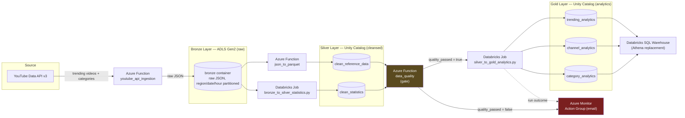
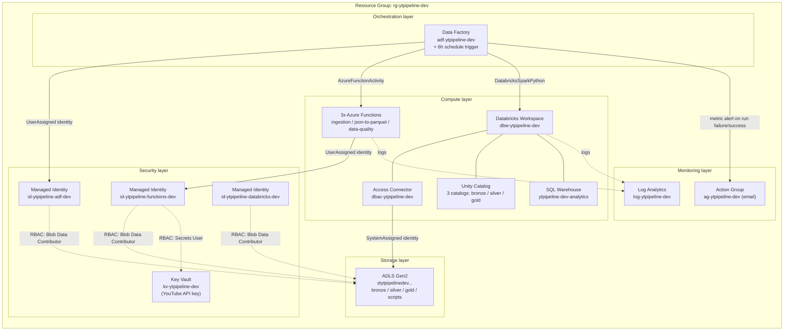
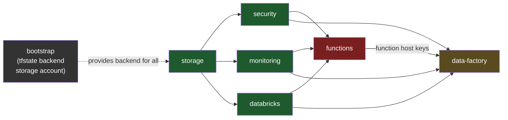
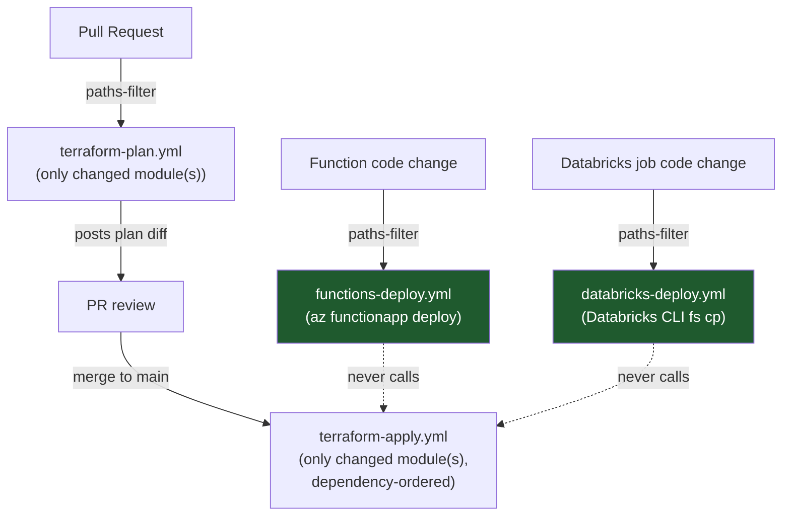

# Architecture — YouTube Trending Data Pipeline (Azure)

## 1. Data flow (pipeline)

Orchestrated by **Azure Data Factory** (`azure/data_factory/pipeline_definition.json`), triggered every 6 hours — mirrors `step_functions/pipeline_orchestation.json` from the AWS version, including the DQ gate that short-circuits Gold aggregation.

## 2. Azure resource topology

## 3. Terraform module / state graph

Each box is an **independent Terraform state file** — this is what makes a
one-module change never touch another module's resources (see
`azure/README.md` §"Why a small change doesn't rebuild everything").

**Legend:** 🟢 deployed and live · 🔴 blocked (App Service quota) · 🟡 pending (needs `functions` first) · ⚫ one-time bootstrap

## 4. CI/CD — why a small change doesn't rebuild everything

Code-only changes (the majority of day-to-day edits) route through the
green paths and **never invoke `terraform apply`** — infrastructure state
is untouched.

## 5. Current deployment status

| Layer | Terraform module | Status |
|---|---|---|
| State backend | `bootstrap` | ✅ Live (`rg-ytpipeline-tfstate`) |
| Data lake | `storage` | ✅ Live |
| Identity/secrets | `security` | ✅ Live |
| Observability | `monitoring` | ✅ Live |
| Spark/SQL | `databricks` | ✅ Live (3 Unity Catalog catalogs, SQL Warehouse) |
| Compute (Functions) | `functions` | 🔴 Blocked — subscription's App Service "Total VMs" quota is 0, needs a support-ticket quota increase |
| Orchestration | `data-factory` | 🟡 Pending — needs `functions` deployed first (function host keys) |
